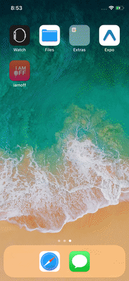

## Healthcal Mobile 1.3

Mobile App written in React Native, deployed on app store and Google play as below:

[App Store Link](https://itunes.apple.com/us/app/i-am-off/id1378071021) 

[Google Play Link](https://play.google.com/store/apps/details?id=com.pokedoc.iamoff)

----------

## To run locally:

	npm install react-native -g

	npm install

iOS:
Download XCode, then run:

	react-native run-ios --simulator="iPhone X"

Android:
Download Java SE Development Kit 8, Android Studio. Plug in Android device with debugger on or open emulator. Then:

	adb devices
	react-native run-android

-------

## Healthcal Server 1.1

Healthcal-Mobile (aka I Am Off!) uses this barebones Node.js app using [Express 4](http://expressjs.com/).

Running Locally

Make sure you have [Node.js](http://nodejs.org/) and the [Heroku CLI](https://cli.heroku.com/) installed.

	$ npm install
	$ npm start

Your app should now be running on [localhost:5000](http://localhost:5000/), however you'll need PostgreSQL set up locally to run it 

## Deploying to Heroku

	
	git add .
	git commit -m "nice commit"
	git push heroku master
	heroku open
